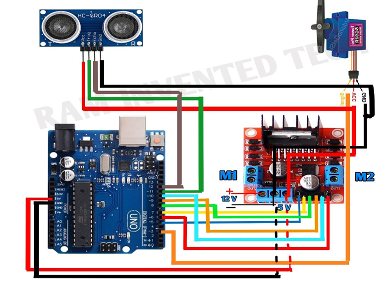
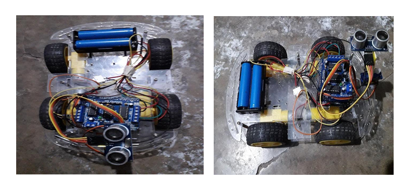

# 🤖 Obstacle Avoiding Robot

**An Obstacle Avoiding Robot** is an autonomous robotic system designed to detect and avoid obstacles in its path using ultrasonic sensors. Built using Arduino, this robot demonstrates basic real-time decision-making using sensor data to navigate safely.

---

## 🧰 Tools & Technologies Used

- **Programming Language**: C / C++ (Arduino)
- **Platform**: Arduino IDE
- **Microcontroller**: Arduino Uno R3
- **Simulation (Optional)**: Proteus / Tinkercad
- **Version Control**: Git + GitHub

---

## ⚙️ Hardware Components

- 🔌 Arduino Uno R3
- 🌐 HC-SR04 Ultrasonic Sensor
- 🛞 L298N Motor Driver Module
- ⚡ DC Motors (x2) with Wheels
- 🔋 Battery Pack (9V or 12V)
- 🔁 Jumper Wires
- 🧠 Chassis and Wheels
- 🔘 Power Switch (optional)

---

## 💡 Working Principle

The robot continuously measures the distance to the nearest object using the **HC-SR04 Ultrasonic Sensor**. When it detects an obstacle within a predefined distance (e.g., < 20 cm), it changes direction by stopping and turning left or right randomly. The process repeats in real time, allowing the robot to navigate autonomously without collisions.

---

## 🏗 Circuit Diagram



## 🏗 Experimental Result



---

## 🚀 Installation & Setup

1. **Clone the Repository**
   ```bash
   git clone https://github.com/SuraiyaMahmuda/An-Obstacle-Avoiding-Robot.git
   cd An-Obstacle-Avoiding-Robot

---

## 🚀 Uploading & Powering the Robot

### 🛠 Open Arduino IDE
- Launch the **Arduino IDE** on your computer.
- Open the `obstacle_avoider.ino` file from the project folder.

---

### 🔁 Upload to Arduino Board
1. Connect your **Arduino Uno** to your computer via USB.
2. In Arduino IDE:
   - Go to `Tools → Board` and select **Arduino Uno**.
   - Go to `Tools → Port` and select the correct COM port.
3. Click the **Upload** button to flash the code onto the Arduino board.

---

### ⚡ Power the Robot
- Connect the **motor driver** and **ultrasonic sensor** to the Arduino following the circuit diagram.
- Use a **battery pack** (e.g., 9V or 12V) to power the motors.
- Ensure all connections are **secure** and **correct** to prevent hardware damage.

---

## 🔧 Usage

- Place the robot on a **flat** and **obstacle-rich** surface.
- Turn on the **power switch**.
- The robot will automatically start **navigating** and **avoiding obstacles**.
- To fine-tune behavior, modify the **threshold distance** in the code:
  ```cpp
  int thresholdDistance = 20; // distance in cm

---

## 📊 Performance

- **Obstacle Detection Accuracy**: ~95% within 30–400 cm range  
- **Reaction Time**: < 0.5 seconds  
- **Navigation Efficiency**: High in clutter-free and semi-structured environments  

